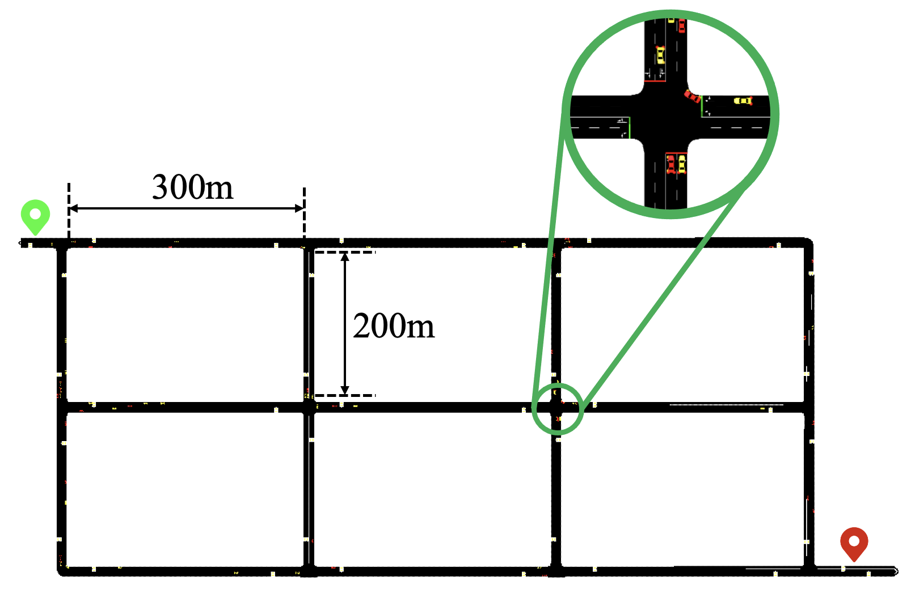

# XRouting
XRouting: An explainable vehicle rerouting system based on reinforcement learning with Transformer structure

</img>

## Table of Contents

- [Installation](#installation)
- [Scenario](#Scenario)
- [Training](#Training)
- [FineTuning](#FineTuning)
- [Evaluation](#Evaluation)


## Installation
Installation instructions are provided for MacOS Monterey 12.4. In order to reproduce the results, the traffic scenario simulator `SUMO with version 1.13.0` and the reinforcement learning training tool `RLlib with version 1.12.0` should be installed. Besides, the version of python is highly recommended to be 3.8. The installation steps are elaborated as follows.
1. Users can install SUMO by following the `macOS section` in https://sumo.dlr.de/docs/Installing/index.html#macos . Note that users are strongly recommended to set `SUMO_HOME directory` carefully. 
2. Users can install Ray/RLlib by following https://docs.ray.io/en/latest/ray-overview/installation.html . Note that `Installing Ray with Anaconda` is highly suggested.
3. It is equally important that the version of tensorflow should be `2.7+`.
4. The versions of xlrd and xlwt should be `1.2.0` for the sake of sucessful running.
5. Note that after installing SUMO, it is prerequisite for users to modify `line 18` in `/rl/env/multi_agent_rerouting_env.py` and `line 21` in `/rl/env/dynamic_rerouting_env.py` for the sake of importing SUMO packages for SUMO and python connection.

## Scenario
The training scenario is defined in the directory `\sumo_scenario\`, including the configuration files `scenario.sumocfg.xml` for training stage and `scenario_rl.sumocfg.xml` for evaluation stage, `scenario.net.xml` for traffic netwrok construction, `exercise.add.xml` for necessary components and `scenario.trips.xml` for determining traffic trips. Note that `edge_coordinates.xlsx` is stored in this directory as well, which is used to store the coordinates information of all edges. The training scenario is illstrated as:

</img>

## Training 
In order to train the models including the proposed XRouting and the other two comparisms (normal PPO and DQN), users are highly recommended to run the `train.py` file in virtue of terminal by following the command:
```
python train.py --run=XRouting
```
Note that input argument `--run` is used to indicate the model to be trained. If users desire to train normal PPO and DQN, the value of `--run` should be set as `PPO` and `DQN` respectively. The default value is `XRouting`. Moreover, there are other argements that could be claimed by users, whose names and meanings can be found by following the command:
```
python train.py -h
```
Note that users can visualize training performance by running `tensorboard --logdir [directory]` in a seperate terminal, where `[directory]` is defaulted to `\training_result\XRouting\PPO` for `XRouting` model, `\training_result\PPO\PPO` for `PPO` model and `\training_result\DQN\DQN` for `DQN` model.

Another important training results are information of trips. More specifically, the basic trip information for each vehicle, including travelling time and travelling length, of each episode during training process is stored in the directory `\training_tripinfo\XRouting_training` for `XRouting` model, `\training_tripinfo\PPO_training` for `PPO` model and `\training_tripinfo\DQN_training` for `DQN` model. 

## Finetuning
Though XRouting model for the aforementioned traffic scenario has been well tuned, users are still able to tune the hyperparameters used for training. More specifically, all the three models hyperparameters tuning can be implemented in the directory `\rl\model_config.py`. For example, the hyperparameters setting for XRouting is illustrated as:
```python
 def XRouting_config(self, env_name):
        """
        Configuration of XRouting actor
        """
        ModelCatalog.register_custom_model("XRouting_model", XRoutingModel)

        return {
            "env": env_name,
            "num_gpus": self.num_gpus,
            "num_envs_per_worker": 1,
            "gamma": 0.99,
            "train_batch_size": 4096,
            "sgd_minibatch_size": 256,
            "lr": 4e-4,
            "vf_loss_coeff": 1e-5,
            "model": {
                "custom_model": "XRouting_model",
                "custom_model_config": {
                    "attention_dim": 64,
                    "num_heads": 4,
                    "head_dim": 32,
                    "mlp_dim": 100,
                    "observation_dim": (38, 6),
                    "pos_encoding_dim": (38, 1),
                }
            },
            "entropy_coeff": 0.01,
            "num_sgd_iter": 4,
            "framework": "tf",
            "num_cpus_per_worker": self.num_cpus_per_worker,
        }
```
For the meaning and function of each hyperparameter, it is strongly recommended that users can search them by following the url: https://docs.ray.io/en/latest/rllib/rllib-algorithms.html .


## Evaluation
After obtaining the trained models, users can evaluate the models in multi-agent scenario by using the following command
```
python evaluation_multi_agent.py --run=XRouting
```
Note that the four well trained models have already been stored in the directory `/trained_models/XRouting/`, and the default model used is `/trained_models/XRouting/checkpoint_1/checkpoint-50`. Userd can also utilize the specific trained model in virtue of the argument `--checkpoint-dir`.
All the evaluation results, that is, the excel files which contains the input observations and the corresponding actions of all the steps that rl vehicles take, are stored in the directory `/evaluation_results/`. 

Furthermore, in the evaluation stage, SUMO_GUI is used for visulization because of one episode.


