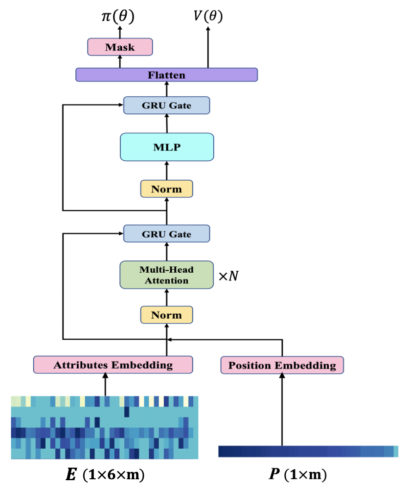

# XRouting
XRouting: An explainable vehicle rerouting system based on reinforcement learning with Transformer structure

</img>

## Table of Contents

- [Installation](#installation)
- [Training Models](#Training Models)

## Installation
Installation instructions are provided for MacOS Monterey 12.4. In order to reproduce the results, the traffic scenario simulator `SUMO with version 1.13.0` and the reinforcement learning training tool `RLlib with version 1.12.0` should be installed. Besides, the version of python is highly recommended to be 3.8. The installation steps are elaborated as follows.
1. Users can install SUMO by following the `macOS section` in https://sumo.dlr.de/docs/Installing/index.html#macos . Note that users are strongly recommended to set `SUMO_HOME directory` carefully. 
2. Users can install Ray/RLlib by following https://docs.ray.io/en/latest/ray-overview/installation.html . Note that `Installing Ray with Anaconda` is highly suggested.
3. It is equally important that the version of tensorflow should be `2.7+`.
4. The versions of xlrd and xlwt should be `1.2.0` for the sake of sucessful running.
5. Note that after installing SUMO, it is prerequisite for users to modify `line 18` in `/rl/env/multi_agent_rerouting_env.py` and `line 21` in `/rl/env/dynamic_rerouting_env.py` for the sake of importing SUMO packages for SUMO and python connection.

## Training Models
